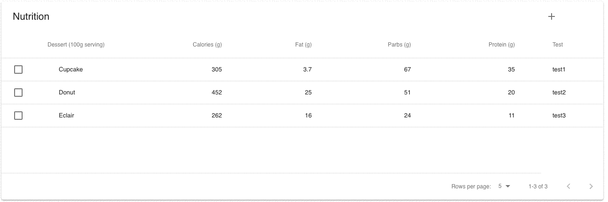

# responsive-table-material-ui

This project provides delete editable responsive table for [Material-UI][material-ui].

Table is shown for desktop screen, list of expandable items - for tablet and mobile.



## Installation

```
npm i --save responsive-table-material-ui
```

## Usage

```jsx
import ResponsiveTable from "responsive-table-material-ui";

const columns = [
  {
    id: "k1",
    numeric: false,
    disablePadding: true,
    label: "Dessert (100g serving)",
    primary: true
  },
  { id: "k2", numeric: true, disablePadding: false, label: "Calories (g)" },
  { id: "k3", numeric: true, disablePadding: false, label: "Fat (g)" },
  { id: "k4", numeric: true, disablePadding: false, label: "Parbs (g)" },
  { id: "k5", numeric: true, disablePadding: false, label: "Protein (g)" },
  { id: "k6", numeric: false, disablePadding: false, label: "Test" }
];

const data = [
  ["Cupcake", 305, 3.7, 67, 35, "test1"],
  ["Donut", 452, 25.0, 51, 20, "test2"],
  ["Eclair", 262, 16.0, 24, 11, "test3"]
];

<ResponsiveTable columns={columns} data={data} />;
```

## ResponsiveTable Properties

1.The field primary key determine the name on the expandable list

## License

The files included in this repository are licensed under the MIT license.

[material-ui]: https://material-ui-next.com/
